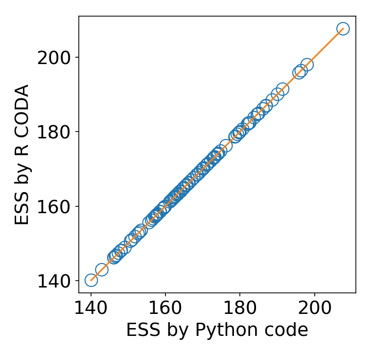

# Markov Chain Monte Carlo (MCMC) diagnostics (Python analogue of R "coda" package)

Python module providing common effective sample size (ESS) estimators along with some convergence diagnostics tools. The `estimate_ess` function computes ESS of one or two-dimensional array along the specified axis:
```python
from mcmc_diagnostics import estimate_ess
ess = estimate_ess(samples, axis=-1)
```

The default ESS estimator uses the same algorithm as the R "coda" and have been checked to yield the same results:
<p align="center">  </p>

Other estimators are also available:
```python
mono_seq_ess = estimate_ess(
    samples, axis=-1, method='monotone-sequence'
)
batch_ess = estimate_ess(
    samples, axis=-1, method='batch-means', options={'n_batch': 50}
)
```
